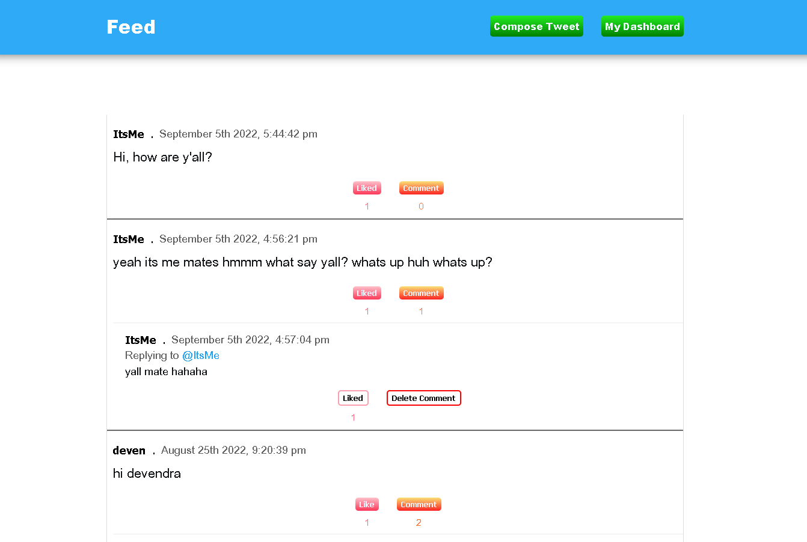

# Twitter-clone

Twitter clone made using Vanilla JS, Mongodb, express.js and node.js.



## Features

- Sign up/ Sign in
- Tweet
- Comment
- Follow user
- Like tweets and comments
- Realtime like feature added using Socket.io
- Edit tweets
- Delete tweets and comments

## Bugs

- App crashes when you tweet for the first ever time

## Contribute

### Prerequisites

- node
- npm
- mongodb

1. Clone this repository
2. Install server dependencies

```
$ cd server
$ npm install
```

### Run the app

1. Start mongodb locally

```
$ mongod
```

2. Start the server

```
$ cd server
$ nodemon server.js
```

## License

This project is made available under the MIT License.
